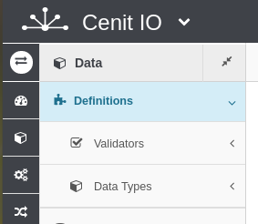
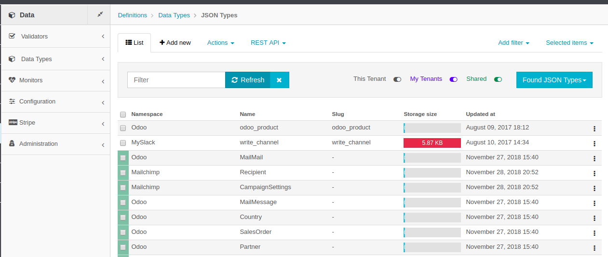
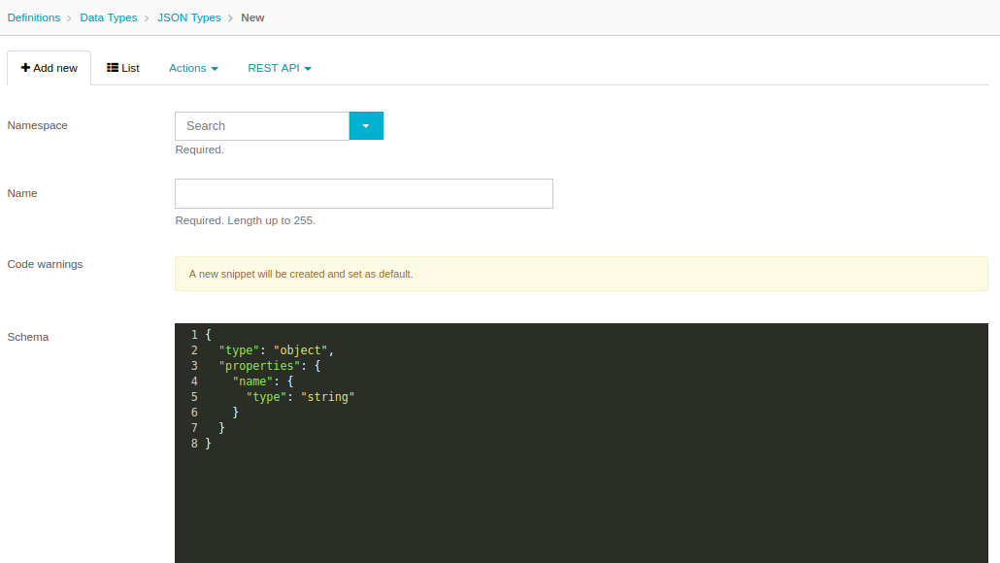
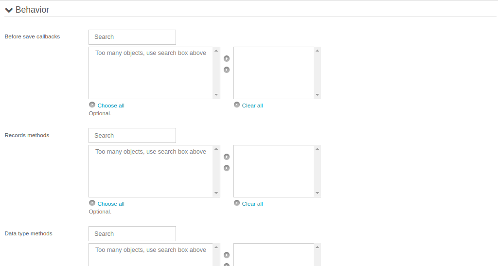

# Definitions

- Menu: `Data/Definitions`
- Sub Menus: 
  - `Validations`
  - `Data Types`

The Definitions are grouped by Validations and Data Types.

## Validators

## Data Types

The Data Types are the data with we will manage in Cenit on the flows, workflows,translators, etc. They can be: JSON Data Types,File Types, and Cenit Types.

- Menu: `Data/Definitions/Data Types`
- Sub Menus: 
  - `JSON Types`
  - `File Types`
  - `Cenit Types`

### JSON Types

The JSON Data Types correspond to a JSON Schema. To learn more about JSON Schema visit this page http://json-schema.org/

>For JSON types objects, you have the "Actions" options. Go to [Actions of Dashboard section](markdown.md) to have more details.

The most important Actions in this section are:

#### Add New

This is the principal form to create a JSON data type, following the sctructure: http://json-schema.org/ in the schema box.

> For underestand the principal concepts or elements of a Cenit form, please consult the Dashboard concept.

#### JSON type Behaivor

Before save callbacks: 
- In this box, the user could define algorithms will be executed before save a record of this data type in a flow process.

Records methods:
- In this box, the user could define algorithms linked to some attributes of the records created of the data type. Is like a method for an specific attribute, and it could be execute in a code of your integration.

Data type methods:
- In this box, the user could define algorithms linked to some attributes of the records created of the data type. Is like a method for an specific attribute, and it could be execute in a code of your integration.

### File Types
### Cenit Types

- Type: `Boolean|String`
- Default: `false`

